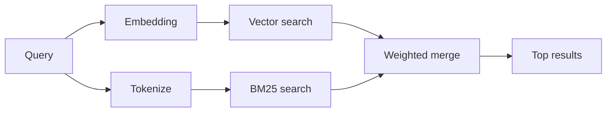

`memory_search` finds relevant notes from your memory files, even when the
wording differs from the original text. It chunks memory into small pieces and
searches them with embeddings, keywords, or both.

## Quick start

OpenClaw uses OpenAI embeddings by default. To use another provider, set it
explicitly:

```json5
{
  agents: {
    defaults: {
      memorySearch: {
        provider: "openai", // or "gemini", "voyage", "mistral", "bedrock", "local", "ollama", "lmstudio", "github-copilot", "openai-compatible"
      },
    },
  },
}
```

`provider` can also reference a custom `models.providers.<id>` entry (for
example `ollama-5080`), as long as that entry sets `api` to `"ollama"` or
another provider id with a memory embedding adapter.

For local embeddings with no API key, install the official llama.cpp provider
plugin and set `provider: "local"`:

```bash
openclaw plugins install @openclaw/llama-cpp-provider
```

Source checkouts still need native build approval: `pnpm approve-builds`, then
`pnpm rebuild node-llama-cpp`.

Some OpenAI-compatible embedding endpoints require asymmetric `input_type`
labels, such as `"query"` for searches and `"document"`/`"passage"` for indexed
chunks. Set these with `queryInputType` and `documentInputType`; see
[Memory configuration reference](/reference/memory-config#provider-specific-config).

## Supported providers

| Provider          | ID                  | Needs API key | Notes                             |
| ----------------- | ------------------- | ------------- | --------------------------------- |
| Bedrock           | `bedrock`           | No            | Uses the AWS credential chain     |
| DeepInfra         | `deepinfra`         | Yes           | Default model `BAAI/bge-m3`       |
| Gemini            | `gemini`            | Yes           | Supports image/audio indexing     |
| GitHub Copilot    | `github-copilot`    | No            | Uses your Copilot subscription    |
| Local             | `local`             | No            | GGUF model, ~0.6 GB auto-download |
| LM Studio         | `lmstudio`          | No            | Local/self-hosted server          |
| Mistral           | `mistral`           | Yes           |                                   |
| Ollama            | `ollama`            | No            | Local/self-hosted server          |
| OpenAI            | `openai`            | Yes           | Default                           |
| OpenAI-compatible | `openai-compatible` | Usually       | Generic `/v1/embeddings` endpoint |
| Voyage            | `voyage`            | Yes           |                                   |

## How search works

OpenClaw runs two retrieval paths in parallel and merges the results:



- **Vector search** matches similar meaning ("gateway host" matches "the
  machine running OpenClaw").
- **BM25 keyword search** matches exact terms (IDs, error strings, config
  keys).

If only one path is available, the other runs alone.

**FTS-only mode.** Set `provider: "none"` to intentionally disable embeddings
and search with keywords only. Leaving `provider` unset or set to `"auto"`
also falls back to keyword-only ranking if no embedding auth is configured,
without erroring, and so does `provider: "local"` (the GGUF/llama.cpp
provider) when it fails.

**Explicit provider unavailable.** If you name any other provider explicitly
(for example `openai`, `ollama`, `gemini`) and it becomes unavailable at
request time (bad auth, network failure), `memory_search` reports memory as
unavailable instead of silently degrading to FTS-only results. This keeps a
broken configured provider visible. Set `provider: "none"` for deliberate
FTS-only recall, or fix the provider/auth configuration to restore semantic
ranking.

## Improving search quality

Two optional features help with a large note history.

### Temporal decay

Old notes gradually lose ranking weight so recent information surfaces first.
With the default 30-day half-life, a note from last month scores at 50% of its
original weight. `MEMORY.md` and other non-dated files under `memory/` are
evergreen and never decayed; only dated `memory/YYYY-MM-DD.md` files decay.

<Tip>
Enable this if your agent has months of daily notes and stale information
keeps outranking recent context.
</Tip>

### MMR (diversity)

Reduces redundant results. If five notes all mention the same router config,
MMR ensures the top results cover different topics instead of repeating.

<Tip>
Enable this if `memory_search` keeps returning near-duplicate snippets from
different daily notes.
</Tip>

### Enable both

```json5
{
  agents: {
    defaults: {
      memorySearch: {
        query: {
          hybrid: {
            mmr: { enabled: true },
            temporalDecay: { enabled: true },
          },
        },
      },
    },
  },
}
```

## Multimodal memory

With `gemini-embedding-2-preview`, you can index images and audio alongside
Markdown. This only applies to files under `memorySearch.extraPaths`; default
memory roots (`MEMORY.md`, `memory/*.md`) stay Markdown-only. Search queries
remain text, but they match against visual and audio content. See
[Memory configuration reference](/reference/memory-config#multimodal-memory-gemini)
for setup.

## Session memory search

Optionally index session transcripts so `memory_search` can recall earlier
conversations. This is opt-in: set `experimental.sessionMemory: true` and add
`"sessions"` to `sources` (default `sources` is `["memory"]`).

Session hits obey `tools.sessions.visibility`: the default `"tree"` only
exposes the current session and sessions it spawned. To recall an unrelated
same-agent session from a different session (for example a gateway-dispatched
session from a DM), widen visibility to `"agent"`.

When using the QMD backend, also set `memory.qmd.sessions.enabled: true` so
transcripts get exported into the QMD collection; `experimental.sessionMemory`
and `sources` alone do not export transcripts into QMD. See
[configuration reference](/reference/memory-config#session-memory-search-experimental).

## Troubleshooting

**No results?** Run `openclaw memory status` to check the index. If empty, run
`openclaw memory index --force`.

**Only keyword matches?** Your embedding provider may not be configured. Check
`openclaw memory status --deep`.

**Local embeddings time out?** `ollama`, `lmstudio`, and `local` use a longer
inline batch timeout by default. If the host is just slow, set
`agents.defaults.memorySearch.sync.embeddingBatchTimeoutSeconds` and rerun
`openclaw memory index --force`.

**CJK text not found?** Rebuild the FTS index with
`openclaw memory index --force`.

## Related

- [Memory overview](/concepts/memory)
- [Active memory](/concepts/active-memory)
- [Builtin memory engine](/concepts/memory-builtin)
- [Memory configuration reference](/reference/memory-config)
