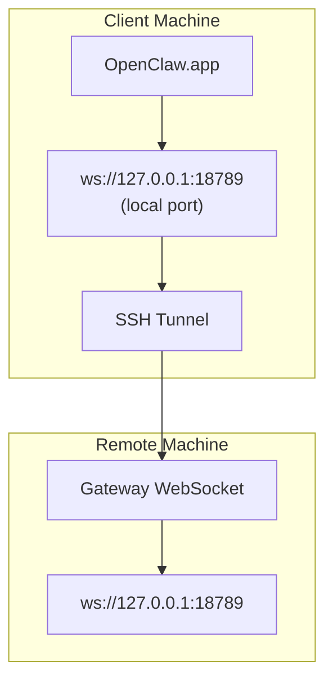

<Note>
This content now lives in [Remote Access](/gateway/remote#macos-persistent-ssh-tunnel-via-launchagent). Use that page for the current guide; this page stays as a redirect target.
</Note>

# Running OpenClaw.app with a Remote Gateway

OpenClaw.app reaches a remote Gateway over an SSH tunnel: an SSH `LocalForward` maps a local port to the Gateway WebSocket port on the remote host.

## Setup

1. Add an SSH config entry with `LocalForward 18789 127.0.0.1:18789` (see [Remote Access](/gateway/remote#macos-persistent-ssh-tunnel-via-launchagent) for the full config block).
2. Copy your SSH key to the remote host with `ssh-copy-id`.
3. Set `gateway.remote.token` (or `gateway.remote.password`) via `openclaw config set gateway.remote.token "<your-token>"`.
4. Start the tunnel: `ssh -N remote-gateway &`.
5. Quit and reopen OpenClaw.app.

For a tunnel that survives reboots and reconnects automatically, use the LaunchAgent setup on the [Remote Access](/gateway/remote#macos-persistent-ssh-tunnel-via-launchagent) page instead of a manual `ssh -N`.

## How it works

| Component                            | What it does                                                  |
| ------------------------------------ | ------------------------------------------------------------- |
| `LocalForward 18789 127.0.0.1:18789` | Forwards local port 18789 to remote port 18789                |
| `ssh -N`                             | SSH without executing remote commands (port forwarding only)  |
| `KeepAlive`                          | Restarts the tunnel automatically if it crashes (LaunchAgent) |
| `RunAtLoad`                          | Starts the tunnel when the LaunchAgent loads (LaunchAgent)    |

OpenClaw.app connects to `ws://127.0.0.1:18789` on the client. The tunnel forwards that connection to port 18789 on the remote host running the Gateway.

## Related

- [Remote access](/gateway/remote)
- [Tailscale](/gateway/tailscale)
