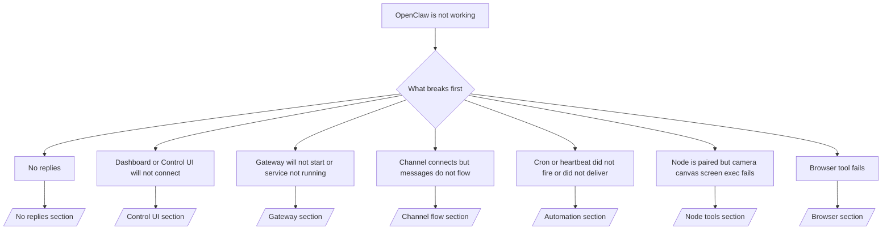

Triage front door. 2 minutes to a diagnosis, then jump to the deep page.

## First 60 seconds

Run this ladder in order:

```bash
openclaw status
openclaw status --all
openclaw gateway probe
openclaw gateway status
openclaw doctor
openclaw channels status --probe
openclaw logs --follow
```

Good output, one line each:

- `openclaw status` shows configured channels, no auth errors.
- `openclaw status --all` produces a full, shareable report.
- `openclaw gateway probe` shows `Reachable: yes`. `Capability: ...` is the
  auth level the probe proved; `Read probe: limited - missing scope:
operator.read` is degraded diagnostics, not a connect failure.
- `openclaw gateway status` shows `Runtime: running`, `Connectivity probe:
ok`, and a plausible `Capability: ...`. Add `--require-rpc` to also require
  read-scope RPC proof.
- `openclaw doctor` reports no blocking config/service errors.
- `openclaw channels status --probe` returns live per-account transport state
  (`works` / `audit ok`) when the gateway is reachable; falls back to
  config-only summaries when it is not.
- `openclaw logs --follow` shows steady activity, no repeating fatal errors.

## Assistant feels limited or missing tools

Check the effective tool profile:

```bash
openclaw status
openclaw status --all
openclaw doctor
```

Common causes:

- `tools.profile: "minimal"` allows only `session_status`.
- `tools.profile: "messaging"` is narrow, for chat-only agents.
- `tools.profile: "coding"` is the default for new local configs (repo, file,
  shell, and runtime work).
- `tools.profile: "full"` removes profile restrictions; limit to trusted
  operator-controlled agents.
- Per-agent `agents.list[].tools` overrides narrow or expand the root profile
  for one agent.

Change the profile, restart or reload the Gateway, then recheck with
`openclaw status --all`. Full profile/group table: [Tool profiles](/gateway/config-tools#tool-profiles).

## Anthropic long context 429

`HTTP 429: rate_limit_error: Extra usage is required for long context requests`
→ [Anthropic 429 extra usage required for long context](/gateway/troubleshooting#anthropic-429-extra-usage-required-for-long-context).

## Local OpenAI-compatible backend works directly but fails in OpenClaw

Your local/self-hosted `/v1` backend answers direct `/v1/chat/completions`
probes but fails on `openclaw infer model run` or normal agent turns:

1. Error mentions `messages[].content` expecting a string: set
   `models.providers.<provider>.models[].compat.requiresStringContent: true`.
2. Still fails only on OpenClaw agent turns: set
   `models.providers.<provider>.models[].compat.supportsTools: false` and retry.
3. Tiny direct calls work but larger OpenClaw prompts crash the backend: that
   is an upstream model/server limit, not an OpenClaw bug. Continue in
   [Local OpenAI-compatible backend passes direct probes but agent runs fail](/gateway/troubleshooting#local-openai-compatible-backend-passes-direct-probes-but-agent-runs-fail).

## Plugin install fails with missing openclaw extensions

`package.json missing openclaw.extensions` means the plugin package uses a
shape OpenClaw no longer accepts.

Fix in the plugin package:

1. Add `openclaw.extensions` to `package.json`, pointing at built runtime
   files (usually `./dist/index.js`).
2. Republish, then run `openclaw plugins install <package>` again.

```json
{
  "name": "@openclaw/my-plugin",
  "version": "1.2.3",
  "openclaw": {
    "extensions": ["./dist/index.js"]
  }
}
```

Reference: [Plugin architecture](/plugins/architecture)

## Install policy blocks plugin installs or updates

Update finishes but plugins are stale, disabled, or show `blocked by install
policy`, `install policy failed closed`, or `Disabled "<plugin>" after plugin
update failure`: check `security.installPolicy`.

Install policy runs on plugin installs and updates. `@openclaw/*` plugin
versions normally move with the OpenClaw release, so an OpenClaw update can
need a matching plugin update during post-update sync.

Avoid these policy shapes unless you also maintain the matching upgrade rule:

- Freezing OpenClaw-owned plugins to one exact old version (for example, only
  `@openclaw/*@2026.5.3`).
- Blocking by source kind alone (every npm, network, or `request.mode:
"update"` request).
- Treating the policy command as optional: when `security.installPolicy` is
  enabled, a missing, slow, unreadable, or permission-blocked policy
  executable fails closed.
- Approving versions without checking the request's `openclawVersion` against
  plugin candidate metadata.

Prefer rules that allow trusted `@openclaw/*` updates compatible with the
current host, instead of pinning one release forever. If you block npm by
default, add a narrow exception for the plugin ids you use, and apply the same
trust rule to `request.mode: "update"` as to installs.

Recovery:

```bash
openclaw doctor --deep
openclaw plugins update --all
openclaw status --all
```

If the policy is intentionally strict, relax it for the trusted upgrade
window, rerun `openclaw plugins update --all`, then restore the stricter rule.
If update failure disabled a plugin, inspect before re-enabling:

```bash
openclaw plugins inspect <plugin-id> --runtime --json
openclaw plugins enable <plugin-id>
```

Reference: [Operator install policy](/tools/skills-config#operator-install-policy-securityinstallpolicy)

## Plugin present but blocked by suspicious ownership

`openclaw doctor`, setup, or startup warnings show:

```text
blocked plugin candidate: suspicious ownership (... uid=1000, expected uid=0 or root)
plugin present but blocked
```

The plugin files are owned by a different Unix user than the process loading
them. Do not remove the plugin config; fix the file ownership, or run
OpenClaw as the user that owns the state directory.

Docker installs run as `node` (uid `1000`). Repair the host bind mounts:

```bash
sudo chown -R 1000:1000 /path/to/openclaw-config /path/to/openclaw-workspace
openclaw doctor --fix
```

If you intentionally run OpenClaw as root, repair the managed plugin root
instead:

```bash
sudo chown -R root:root /path/to/openclaw-config/npm
openclaw doctor --fix
```

Deeper docs: [Blocked plugin path ownership](/tools/plugin#blocked-plugin-path-ownership), [Docker: Permissions and EACCES](/install/docker#shell-helpers-optional)

## Decision tree



<AccordionGroup>
  <Accordion title="No replies">
    ```bash
    openclaw status
    openclaw gateway status
    openclaw channels status --probe
    openclaw pairing list --channel <channel> [--account <id>]
    openclaw logs --follow
    ```

    Good output:

    - `Runtime: running`
    - `Connectivity probe: ok`
    - `Capability: read-only`, `write-capable`, or `admin-capable`
    - Channel shows transport connected and, where supported, `works` or
      `audit ok` in `channels status --probe`
    - Sender is approved (or DM policy is open/allowlist)

    Log signatures:

    - `drop guild message (mention required` → Discord mention gating blocked the message.
    - `pairing request` → sender unapproved, waiting on DM pairing approval.
    - `blocked` / `allowlist` in channel logs → sender, room, or group filtered.

    Deep pages: [No replies](/gateway/troubleshooting#no-replies), [Channel troubleshooting](/channels/troubleshooting), [Pairing](/channels/pairing)

  </Accordion>

  <Accordion title="Dashboard or Control UI will not connect">
    ```bash
    openclaw status
    openclaw gateway status
    openclaw logs --follow
    openclaw doctor
    openclaw channels status --probe
    ```

    Good output:

    - `Dashboard: http://...` shown in `openclaw gateway status`
    - `Connectivity probe: ok`
    - `Capability: read-only`, `write-capable`, or `admin-capable`
    - No auth loop in logs

    Log signatures:

    - `device identity required` → HTTP/non-secure context cannot complete device auth.
    - `origin not allowed` → browser `Origin` is not allowed for the Control UI gateway target.
    - `AUTH_TOKEN_MISMATCH` with `canRetryWithDeviceToken=true` → one trusted device-token retry may occur automatically, reusing the paired token's cached scopes.
    - repeated `unauthorized` after that retry → wrong token/password, auth mode mismatch, or stale paired device token.
    - `too many failed authentication attempts (retry later)` → repeated failures from that browser `Origin` are temporarily locked out; other localhost origins use separate buckets. See [Dashboard/Control UI connectivity](/gateway/troubleshooting#dashboard-control-ui-connectivity) for the Tailscale Serve concurrent-retry nuance.
    - `gateway connect failed:` → UI targets the wrong URL/port, or the gateway is unreachable.

    Deep pages: [Dashboard/Control UI connectivity](/gateway/troubleshooting#dashboard-control-ui-connectivity), [Control UI](/web/control-ui), [Authentication](/gateway/authentication)

  </Accordion>

  <Accordion title="Gateway will not start or service installed but not running">
    ```bash
    openclaw status
    openclaw gateway status
    openclaw logs --follow
    openclaw doctor
    openclaw channels status --probe
    ```

    Good output:

    - `Service: ... (loaded)`
    - `Runtime: running`
    - `Connectivity probe: ok`
    - `Capability: read-only`, `write-capable`, or `admin-capable`

    Log signatures:

    - `Gateway start blocked: set gateway.mode=local` or `existing config is missing gateway.mode` → gateway mode is remote, or config is missing the local-mode stamp and needs repair.
    - `refusing to bind gateway ... without auth` → non-loopback bind without a valid auth path (token/password, or trusted-proxy where configured).
    - `another gateway instance is already listening` or `EADDRINUSE` → port already taken.

    Deep pages: [Gateway service not running](/gateway/troubleshooting#gateway-service-not-running), [Background process](/gateway/background-process), [Configuration](/gateway/configuration)

  </Accordion>

  <Accordion title="Channel connects but messages do not flow">
    ```bash
    openclaw status
    openclaw gateway status
    openclaw logs --follow
    openclaw doctor
    openclaw channels status --probe
    ```

    Good output:

    - Channel transport connected.
    - Pairing/allowlist checks pass.
    - Mentions detected where required.

    Log signatures:

    - `mention required` → group mention gating blocked processing.
    - `pairing` / `pending` → DM sender not approved yet.
    - `not_in_channel`, `missing_scope`, `Forbidden`, `401/403` → channel permission token issue.

    Deep pages: [Channel connected, messages not flowing](/gateway/troubleshooting#channel-connected-messages-not-flowing), [Channel troubleshooting](/channels/troubleshooting)

  </Accordion>

  <Accordion title="Cron or heartbeat did not fire or did not deliver">
    ```bash
    openclaw status
    openclaw gateway status
    openclaw cron status
    openclaw cron list
    openclaw cron runs --id <jobId> --limit 20
    openclaw logs --follow
    ```

    Good output:

    - `cron status` shows the scheduler enabled with a next wake.
    - `cron runs` shows recent `ok` entries.
    - Heartbeat is enabled and inside active hours.

    Log signatures:

    - `cron: scheduler disabled; jobs will not run automatically` → cron is disabled.
    - `heartbeat skipped` reason `quiet-hours` → outside configured active hours.
    - `heartbeat skipped` reason `empty-heartbeat-file` → `HEARTBEAT.md` exists but contains only blank, comment, header, fence, or empty-checklist scaffolding.
    - `heartbeat skipped` reason `no-tasks-due` → task mode is active but no task interval is due yet.
    - `heartbeat skipped` reason `alerts-disabled` → `showOk`, `showAlerts`, and `useIndicator` are all off.
    - `requests-in-flight` → main lane busy; heartbeat wake deferred.
    - `unknown accountId` → heartbeat delivery target account does not exist.

    Deep pages: [Cron and heartbeat delivery](/gateway/troubleshooting#cron-and-heartbeat-delivery), [Scheduled tasks: Troubleshooting](/automation/cron-jobs#troubleshooting), [Heartbeat](/gateway/heartbeat)

  </Accordion>

  <Accordion title="Node is paired but tool fails camera canvas screen exec">
    ```bash
    openclaw status
    openclaw gateway status
    openclaw nodes status
    openclaw nodes describe --node <idOrNameOrIp>
    openclaw logs --follow
    ```

    Good output:

    - Node listed as connected and paired for role `node`.
    - Capability exists for the command you are invoking.
    - Permission state granted for the tool.

    Log signatures:

    - `NODE_BACKGROUND_UNAVAILABLE` → bring the node app to the foreground.
    - `*_PERMISSION_REQUIRED` → OS permission denied/missing.
    - `SYSTEM_RUN_DENIED: approval required` → exec approval is pending.
    - `SYSTEM_RUN_DENIED: allowlist miss` → command not on the exec allowlist.

    Deep pages: [Node paired, tool fails](/gateway/troubleshooting#node-paired-tool-fails), [Node troubleshooting](/nodes/troubleshooting), [Exec approvals](/tools/exec-approvals)

  </Accordion>

  <Accordion title="Exec suddenly asks for approval">
    ```bash
    openclaw config get tools.exec.host
    openclaw config get tools.exec.security
    openclaw config get tools.exec.ask
    openclaw gateway restart
    ```

    What changed:

    - Unset `tools.exec.host` defaults to `auto`, which resolves to `sandbox`
      when a sandbox runtime is active, `gateway` otherwise.
    - `host=auto` only routes; the no-prompt behavior comes from
      `security=full` plus `ask=off` on gateway/node.
    - Unset `tools.exec.security` defaults to `full` on `gateway`/`node`.
    - Unset `tools.exec.ask` defaults to `off`.
    - If you are seeing approvals, some host-local or per-session policy
      tightened exec away from these defaults.

    Restore the current no-approval defaults:

    ```bash
    openclaw config set tools.exec.host gateway
    openclaw config set tools.exec.security full
    openclaw config set tools.exec.ask off
    openclaw gateway restart
    ```

    Safer alternatives:

    - Set only `tools.exec.host=gateway` for stable host routing.
    - Use `security=allowlist` with `ask=on-miss` for host exec with review on
      allowlist misses.
    - Enable sandbox mode so `host=auto` resolves back to `sandbox`.

    Log signatures:

    - `Approval required.` → command is waiting on `/approve ...`.
    - `SYSTEM_RUN_DENIED: approval required` → node-host exec approval is pending.
    - `exec host=sandbox requires a sandbox runtime for this session` → implicit/explicit sandbox selection but sandbox mode is off.

    Deep pages: [Exec](/tools/exec), [Exec approvals](/tools/exec-approvals), [Security: What the audit checks](/gateway/security#what-the-audit-checks-high-level)

  </Accordion>

  <Accordion title="Browser tool fails">
    ```bash
    openclaw status
    openclaw gateway status
    openclaw browser status
    openclaw logs --follow
    openclaw doctor
    ```

    Good output:

    - Browser status shows `running: true` and a chosen browser/profile.
    - `openclaw` profile starts, or `user` profile sees local Chrome tabs.

    Log signatures:

    - `unknown command "browser"` → `plugins.allow` is set and excludes `browser`.
    - `Failed to start Chrome CDP on port` → local browser launch failed.
    - `browser.executablePath not found` → configured binary path is wrong.
    - `browser.cdpUrl must be http(s) or ws(s)` → configured CDP URL uses an unsupported scheme.
    - `browser.cdpUrl has invalid port` → configured CDP URL has a bad or out-of-range port.
    - `No Chrome tabs found for profile="user"` → the Chrome MCP attach profile has no open local Chrome tabs.
    - `Remote CDP for profile "<name>" is not reachable` → configured remote CDP endpoint unreachable from this host.
    - `Browser attachOnly is enabled ... not reachable` → attach-only profile has no live CDP target.
    - Stale viewport/dark-mode/locale/offline overrides on attach-only or remote CDP profiles → run `openclaw browser stop --browser-profile <name>` to close the control session and release emulation state without restarting the gateway.

    Deep pages: [Browser tool fails](/gateway/troubleshooting#browser-tool-fails), [Missing browser command or tool](/tools/browser#missing-browser-command-or-tool), [Browser: Linux troubleshooting](/tools/browser-linux-troubleshooting), [Browser: WSL2/Windows remote CDP troubleshooting](/tools/browser-wsl2-windows-remote-cdp-troubleshooting)

  </Accordion>

</AccordionGroup>

## Related

- [FAQ](/help/faq) — frequently asked questions
- [Gateway Troubleshooting](/gateway/troubleshooting) — gateway-specific issues
- [Doctor](/gateway/doctor) — automated health checks and repairs
- [Channel Troubleshooting](/channels/troubleshooting) — channel connectivity issues
- [Scheduled tasks: Troubleshooting](/automation/cron-jobs#troubleshooting) — cron and heartbeat issues
